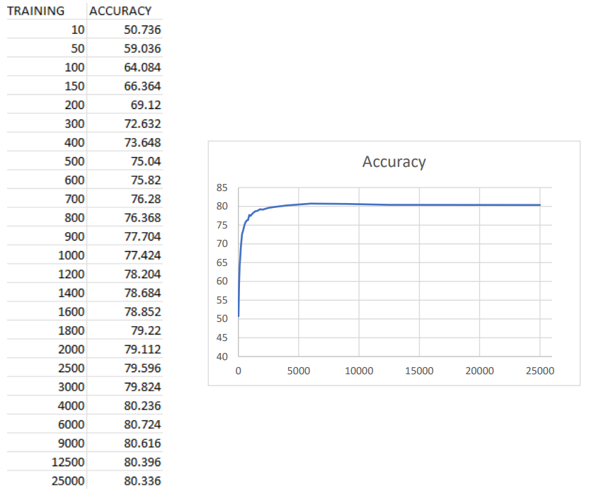
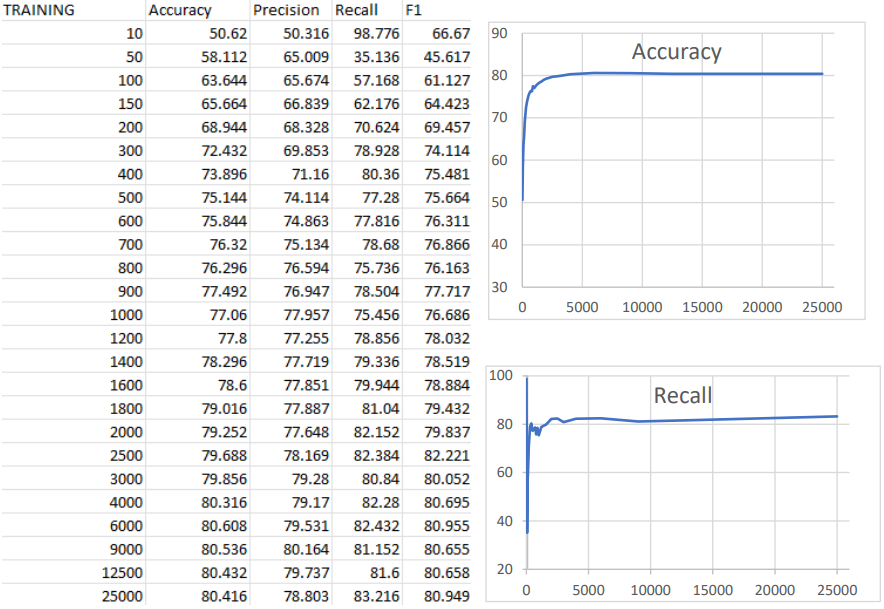
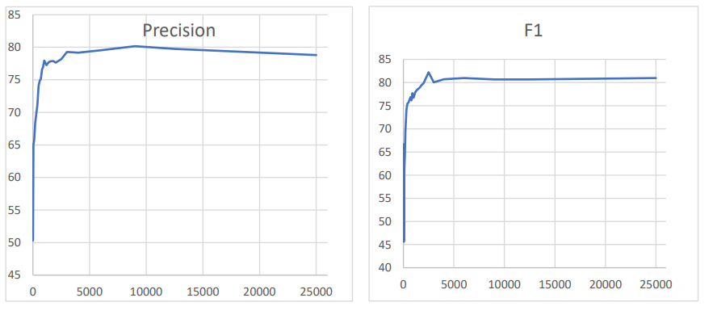
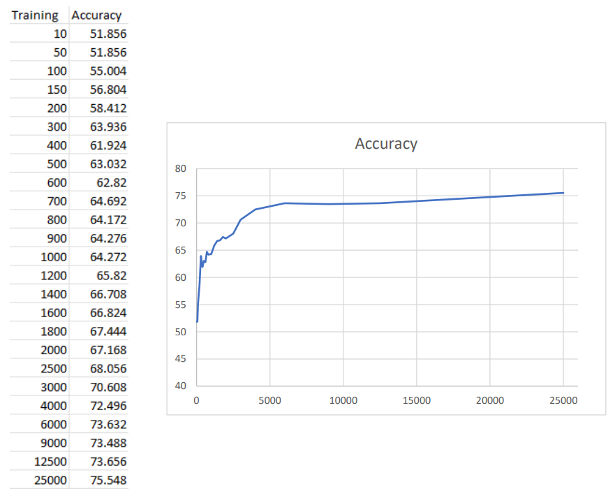
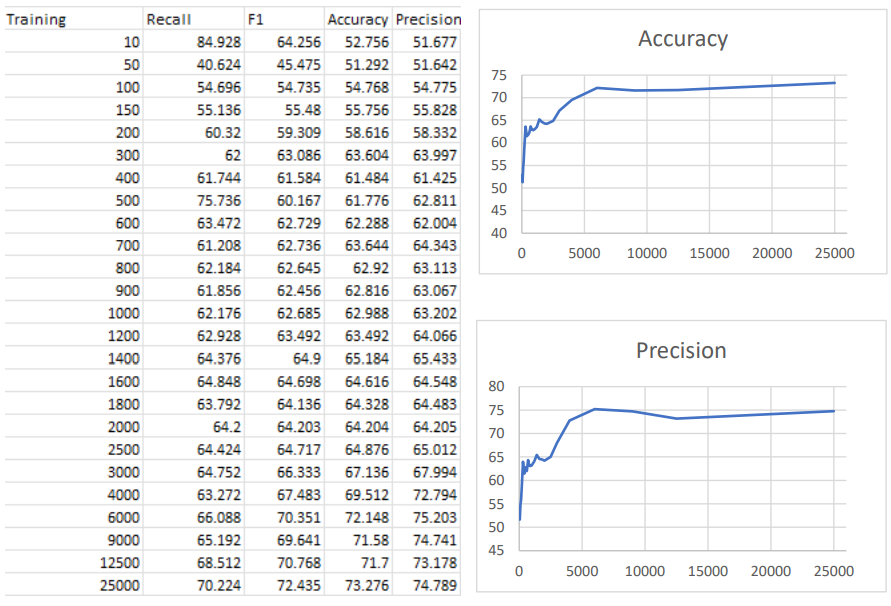
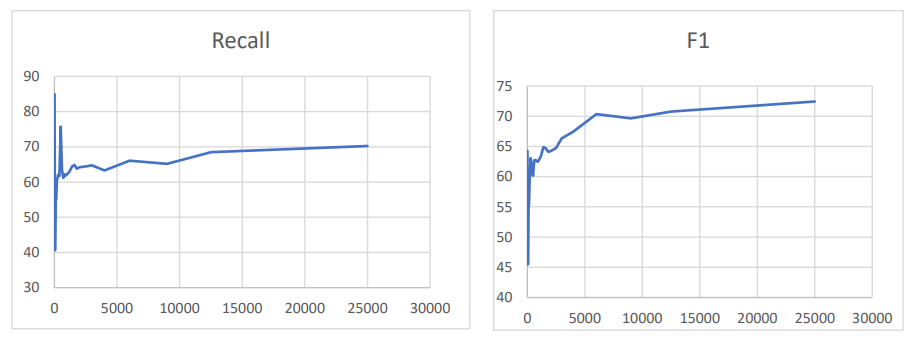

# IMDB Reviews Evaluator

## Objective

The objective of this project was to develop Machine Learning algorithms in order to be able to categorize IMDB reviews as positive or negative efficiently. The algorithms we used are Naive Bayes and ID3.

## Statistics of Naive Bayes on Training Dataset

## Statistics of Naive Bayes on Test Dataset

## Statistics of ID3 on Training Dataset

## Statistics of ID3 on Test Dataset

## Setting up

Make sure the paths to the aclImdb folder are correct.

Compile the java files in the src folder. Or just drag and drop the java files in your IDE. Then:

- Execute App if you want to run the Naive Bayes algorithm
- Execute the App2 if you want to run the ID3 algorithm

## Execution parameters

- m = the number of words that will be used for training, read from "imdb.vocab" (default value = 600)
- skipWords = the number of words that will be skipped before starting to read the m words from "imdb.vocab" (default value = 100)
- positiveTrainReviews = the number of positive training reviews to be used for training (default value = 12500)
- negativeTrainReviews = the number of negative training reviews to be used for training (default value = 12500)
- positiveTestReviews = the number of positive training reviews to be evaluated (default value = 12500)
- negativeTestReviews = the number of positive training reviews to be evaluated (default value = 12500)

Authors
[Dimitris Milios](https://github.com/DimMil24 "Dimitris Milios"),
[Giannis Mparous](https://github.com/giannismparous "Giannis Mparous")
